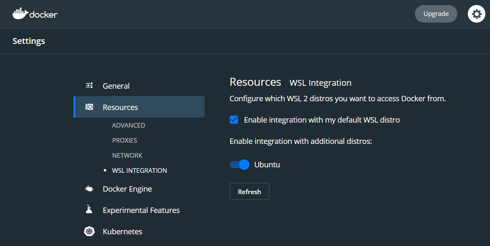

# Build Instructions

* Install [Docker Desktop](https://www.docker.com/products/docker-desktop)
* If on Windows, install and enable [WSL2](https://docs.microsoft.com/en-us/windows/wsl/install-win10) 
    * Ensure that WSL2 compatibility is enabled in Docker 
    * In Command Prompt / Windows Terminal to enter your Linux Subsystem
        * `wsl`
    * Create a user that's not root if you haven't been prompted by Linux
        * `adduser username`
        * `usermod -aG sudo username`
* `cd ~`
* `sudo apt-get update`
* Install Composer & Dependencies
    * `sudo apt install git wget curl openssl php php-common php-curl php-json php-mbstring php-mysql php-xml php-zip`
    * `curl -sS https://getcomposer.org/installer |php`
    * `sudo mv composer.phar /usr/bin/composer`
* `git clone https://github.com/daniel-rachfal/MorseCode/ && cd MorseCode`
* `composer update`
* `cp .env.example .env`
* `./vendor/bin/sail up`
* `./vendor/bin/sail artisan migrate --seed`

If you're getting permission issues just run `sudo chmod -R 777 storage`. It's not a good solution, but it works.

I really thought this would be easier
